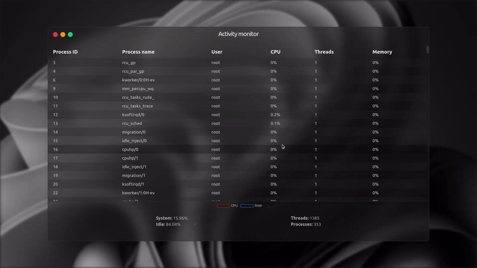

# Resource monitor

A task manager/resource monitor version for the web using websockets.

## Preview

## How to run?

1. Install the dependencies for each package
2. Start the server first using `npm run dev` or `npm run start`
3. Start the frontend client using `npm run dev`.

## Author

|  |
| ----------------------------------------------------- |
| [Eder Lima](https://github.com/Nxrth-x)               |
